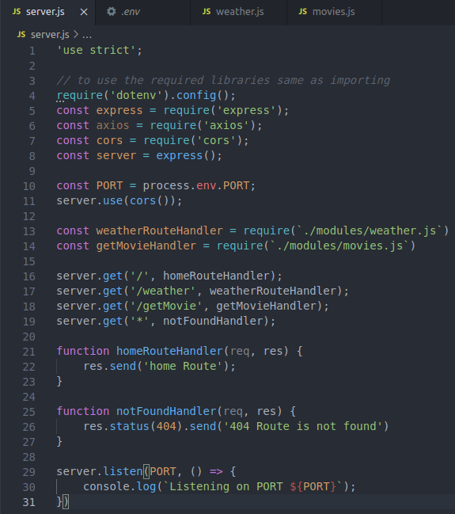
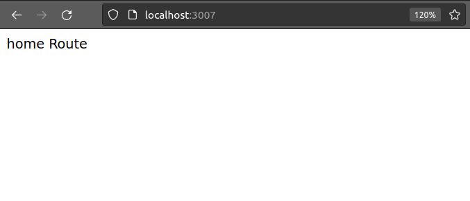
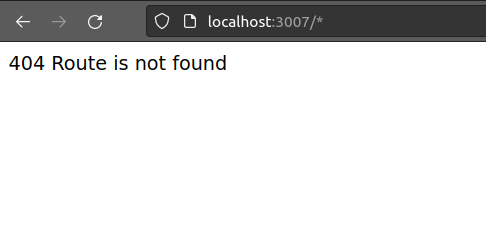
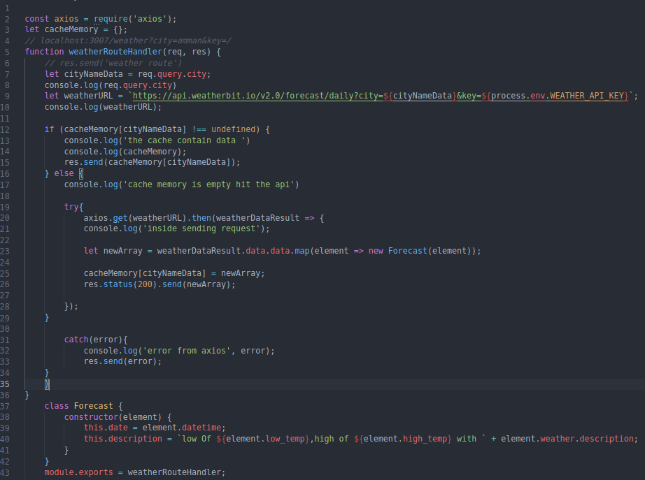
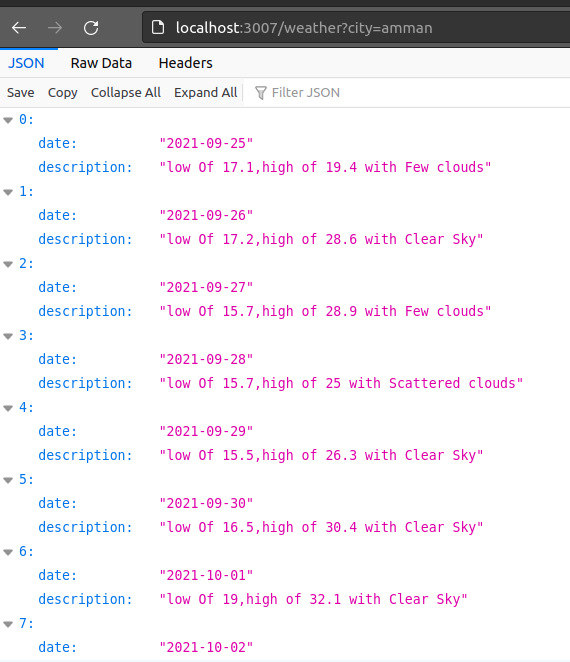
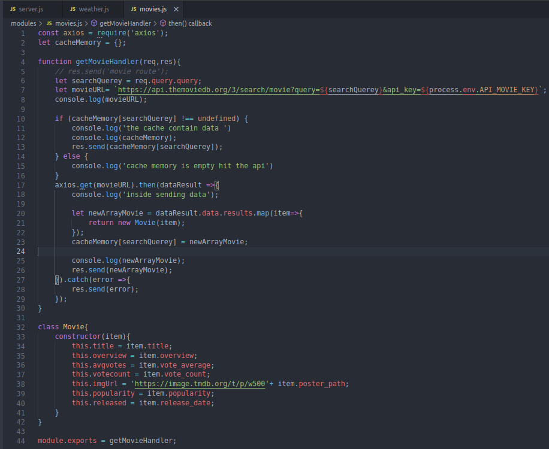
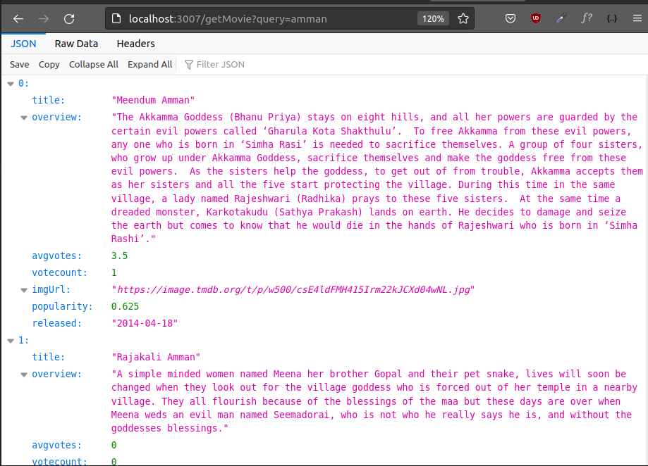

# Testing of the application

• **Perform a white box and black box testing for the developed application, document the results**

* **White box Testing:**

In this section I'm going to test my API server Result code and provide you with results.

* First of All This is my server side Code:



* In the first 4-11 lines of code, I've downloaded the required libraries and started to use them.

* In Line 13 & 14 I have created modules for each Weather and Movie Api so to make to code cleaner and reusable.

* In lines 16-19 I've created 4 Routes some of them for testing and the other for getting the required data from the API. So let's test them:

1. **First Route** (```server.get('/', homeRouteHandler);```)



And it's working 💯

2. **Not found Route** (```server.get('*', notFoundHandler);```)



And it's working 💯

----

In this section I will test Weather and movie Route with their Code.

1. **Weather Route** (```server.get('/weather', weatherRouteHandler);```

* Code Implementation:



* Testing The Route if it's return the required Data for specific city: 



And it's working 💯


2. **Movie Route** (```server.get(''/getMovie', getMovieHandler);```

* Code Implementation:



* Testing The Route if it's return the required Data for specific city: 



And it's working 💯
